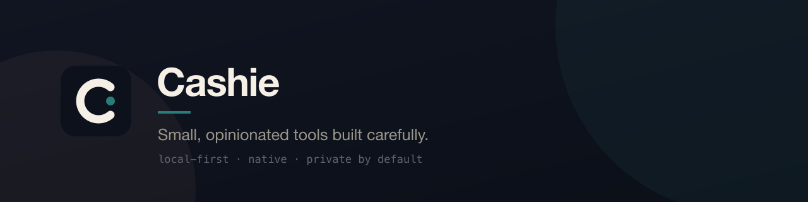

`posture · local-first` `design · DEPTHS` `stack · rust · swift · typescript`

## Now building

**TuneDeck** — a macOS-focused terminal music experience built on the
spotatui / spotify-tui lineage, with downstream improvements, packaging,
and product direction. `maintained fork · preview`

## Featured

| | | |
|---|---|---|
| **[FileSift](https://github.com/Cashie1597/filesift)** | File organisation for macOS with receipts and rollback — every change provable and reversible. | `stable` |
| **Recto** | Design-system-aware document viewer: opens a repo, detects its design tokens, renders its docs in the project's own identity. | `preview · source release pending` |

## Open source

Contributor to **OpenModel** — `om status` command and llama.cpp config
support, [merged upstream](https://github.com/wundercorp/openmodel/pull/14).

## DEPTHS

A cross-project design system: six locked primitives, semantic tokens,
consumed at runtime. First consumer: Recto's token bridge.

## Philosophy

- Local-first: software should work with the network unplugged.
- Receipts over trust: destructive operations produce evidence and rollback paths.
- Read-only by default: tools that view are incapable of writing.
- Small and finished beats large and abandoned.
